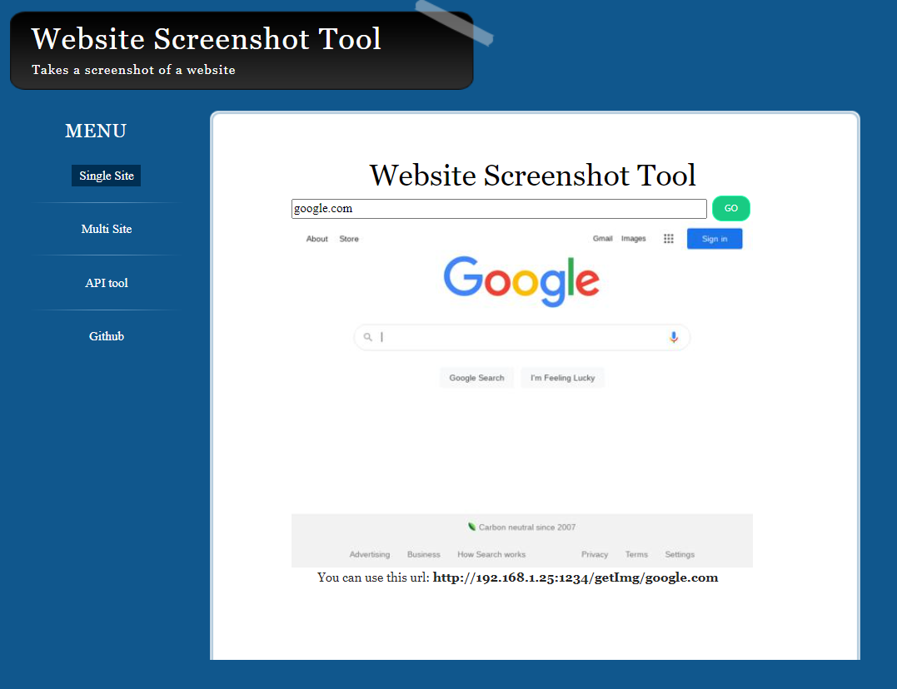
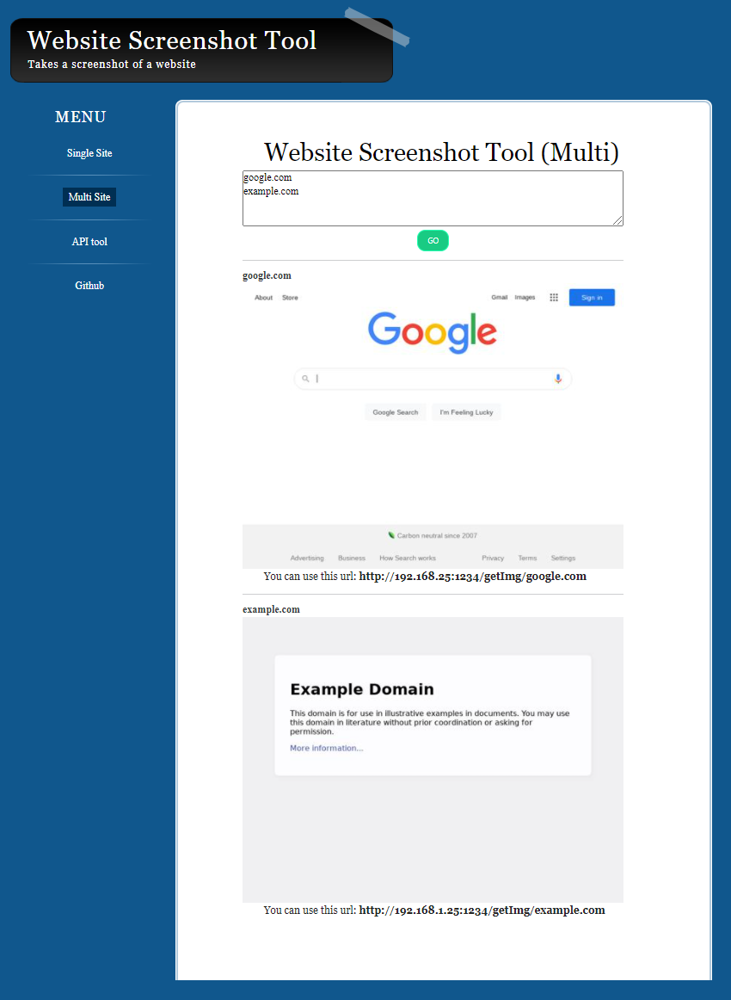
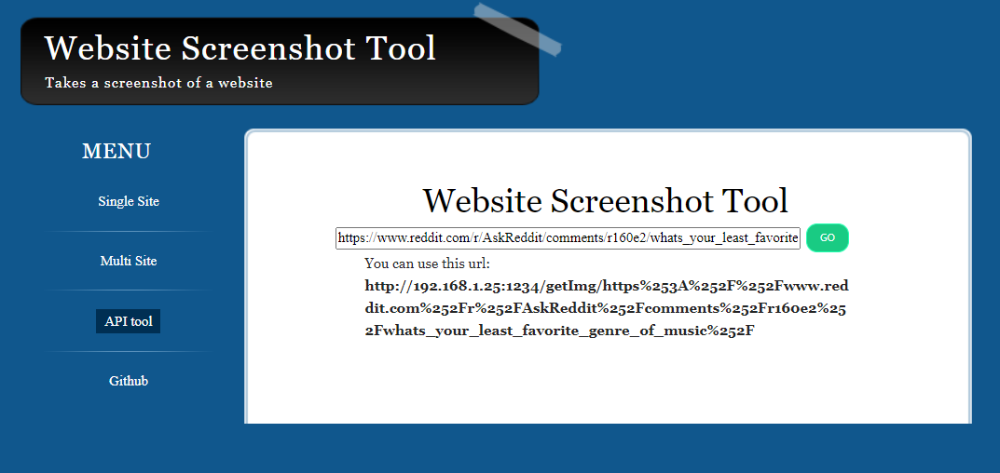

# Website Screenshot Tool
This is a flask hosted api that takes screenshots of a website using pyppeteer. All wrapped in a simple to use docker.

# How to use
## Starting the container

### Building
You can run buildImage.sh, you will need to be able to call the ng command. You can do this by installing angular globally.
```bash
npm install -g @angular/cli
./buildImage.sh
```

### Dockerhub
```bash
docker pull julesbrn/website-screenshot-tool:v1
```

## Starting the container
Flask listens on port 1111.
```bash
docker run -dit --name website-screenshot-tool \
-p 1234:1111 \
--restart unless-stopped \
julesbrn/website-screenshot-tool:v1
```

## Using the web tool
You can visit the root url to access the web tool. Using this, you can either test the tool or use the tool.




### API
There is a page in the web tool to help you use the api.



## Using as an api
In this example, we will use 
www.reddit.com/r/AskReddit/comments/r172zf/what_are_some_really_subtle_signs_that_a_person/

The url to use the api would be 
localhost:1234/getImg/www.reddit.com%252Fr%252FAskReddit%252Fcomments%252Fr172zf%252Fwhat_are_some_really_subtle_signs_that_a_person%252F

To get this result:

1. Urlencode your whole url (https://www.w3schools.com/tags/ref_urlencode.ASP)
2. Determine the ip and port of the tool. (e.g. 192.168.1.25:1234)
3. {ip}:{port}/getImg/{urlencoded string}

The result can then either be accessed directly, or viewed in an img tag.
```html

```

You can also use the web tool. (See above for screenshot.)

# Notes
This docker does not provide any security against malicious websites. It is not recommended to use this tool for potentially unsafe urls.

This docker provides two security aspects, docker itself and javascript is disabled. Use with caution.

## License
[GNU GPLv3](https://choosealicense.com/licenses/gpl-3.0/)

Contact me for commercial use.